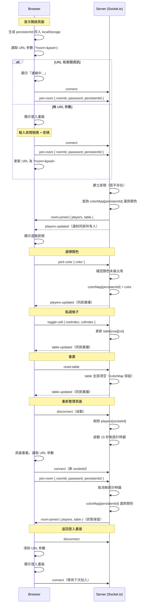
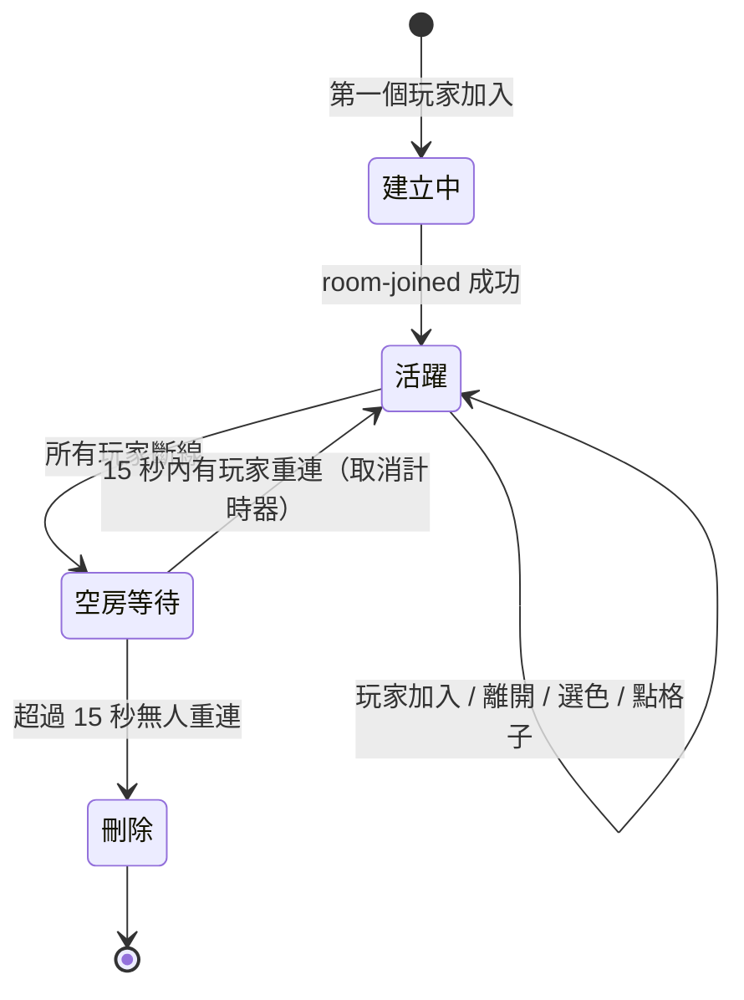
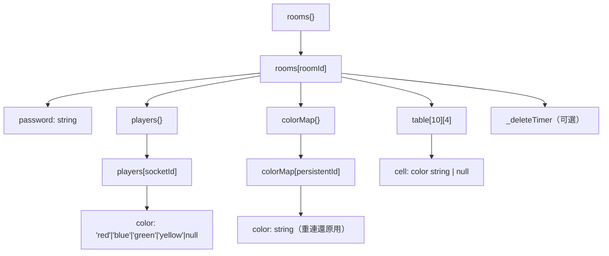
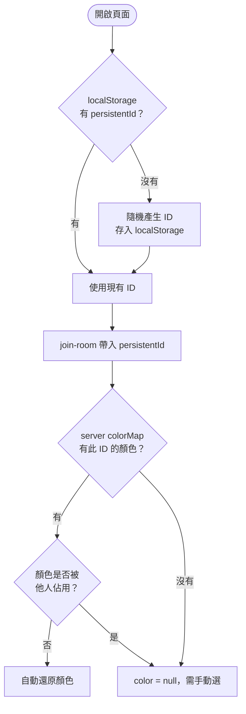

# Architecture Diagrams

## 完整流程（Sequence Diagram）

```mermaid
sequenceDiagram
    participant B as Browser
    participant S as Server (Socket.io)

    Note over B: 首次開啟頁面
    B->>B: 生成 persistentId 存入 localStorage
    B->>B: 讀取 URL 參數 (?room=&pwd=)

    alt URL 有房間資訊
        B->>B: 顯示「連線中...」
        B->>S: connect
        B->>S: join-room { roomId, password, persistentId }
    else 無 URL 參數
        B->>B: 顯示登入畫面
        Note over B: 輸入房間號碼 + 密碼
        B->>S: connect
        B->>S: join-room { roomId, password, persistentId }
        B->>B: 更新 URL 為 ?room=&pwd=
    end

    S->>S: 建立房間（若不存在）
    S->>S: 查詢 colorMap[persistentId] 還原顏色
    S->>B: room-joined { players, table }
    S-->>B: players-updated（通知同房所有人）
    B->>B: 顯示遊戲房間

    Note over B,S: 選擇顏色
    B->>S: pick-color { color }
    S->>S: 確認顏色未被占用
    S->>S: colorMap[persistentId] = color
    S-->>B: players-updated（同房廣播）

    Note over B,S: 點選格子
    B->>S: toggle-cell { rowIndex, colIndex }
    S->>S: 更新 table[row][col]
    S-->>B: table-updated（同房廣播）

    Note over B,S: 重置
    B->>S: reset-table
    S->>S: table 全部清空（colorMap 保留）
    S-->>B: table-updated（同房廣播）

    Note over B,S: 重新整理頁面
    B->>S: disconnect（自動）
    S->>S: 刪除 players[socketId]
    S->>S: 啟動 15 秒刪房計時器

    B->>B: 頁面重載，讀取 URL 參數
    B->>S: connect（新 socketId）
    B->>S: join-room { roomId, password, persistentId }
    S->>S: 取消刪房計時器
    S->>S: colorMap[persistentId] 還原顏色
    S->>B: room-joined { players, table }（狀態保留）

    Note over B,S: 返回登入畫面
    B->>S: disconnect
    B->>B: 清除 URL 參數
    B->>B: 顯示登入畫面
    B->>S: connect（等待下次加入）
```

---

## 房間生命週期（State Diagram）

```mermaid
stateDiagram-v2
    [*] --> 建立中 : 第一個玩家加入

    建立中 --> 活躍 : room-joined 成功

    活躍 --> 活躍 : 玩家加入 / 離開 / 選色 / 點格子

    活躍 --> 空房等待 : 所有玩家斷線
    空房等待 --> 活躍 : 15 秒內有玩家重連（取消計時器）
    空房等待 --> 刪除 : 超過 15 秒無人重連

    刪除 --> [*]
```

---

## 後端資料結構

```mermaid
graph TD
    rooms["rooms{}"]
    rooms --> roomId["rooms[roomId]"]

    roomId --> password["password: string"]
    roomId --> players["players{}"]
    roomId --> colorMap["colorMap{}"]
    roomId --> table["table[10][4]"]
    roomId --> timer["_deleteTimer（可選）"]

    players --> socketId["players[socketId]"]
    socketId --> color["color: 'red'|'blue'|'green'|'yellow'|null"]

    colorMap --> pid["colorMap[persistentId]"]
    pid --> savedColor["color: string（重連還原用）"]

    table --> cell["cell: color string | null"]
```

---

## persistentId 運作原理

```mermaid
flowchart TD
    A([開啟頁面]) --> B{localStorage\n有 persistentId？}
    B -- 有 --> D[使用現有 ID]
    B -- 沒有 --> C[隨機產生 ID\n存入 localStorage]
    C --> D

    D --> E[join-room 帶入 persistentId]
    E --> F{server colorMap\n有此 ID 的顏色？}

    F -- 有 --> G{顏色是否被\n他人佔用？}
    G -- 否 --> H[自動還原顏色]
    G -- 是 --> I[color = null，需手動選]

    F -- 沒有 --> I
```
